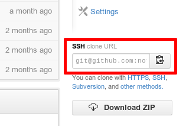
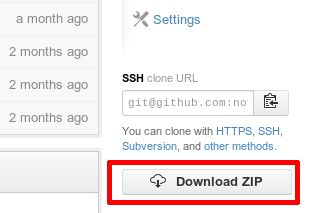
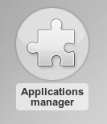
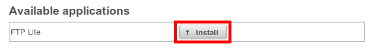

Installer une application dans Novius OS
########################################

Où trouver des applications ?
*****************************

`Le compte GitHub de Novius OS <http://github.com/novius-os>`__ est un bon point de départ.

La `page des contributeurs <http://community.novius-os.org/fr/contribuez/nos-super-contributeurs.html>`__ sur le site Novius OS liste des applications de la communauté.

Vous pouvez également aller directement sur les comptes GitHub de `Fumito Mizuno <http://github.com/ounziw>`__ et de `Novius Agency <http://github.com/novius>`__ qui contiennent beaucoup d'applications.

Installer une nouvelle application
**********************************

2 solutions sont possibles : utiliser **Git** ou via un **fichier .zip**.

Méthode 1 : utiliser Git
========================

Sur GitHub, copiez l'URL Git du dépôt :

Cloner ensuite le dépôt dans le répertoire :file:`/local/applications/`.

.. code-block:: bash

    cd local/applications
    git clone URL_DU_DEPOT

Enfin, n'oubliez pas d'aller :ref:`activer l'application <manage/install_app/activate>` depuis le gestionnaire d'applications.

Méthode 2 : via un fichier .zip
===============================

Sur GitHub, télécharger l'application sous forme de fichier **.zip**.

Dézipper l'archive téléchargée dans le répertoire :file:`/local/applications/`.

Renommer le répertoire créé pour supprimer le nom de la branche (rajouté automatiquement par GitHub).
Par exemple, il faut renommer :file:`novius_ftplite-master-elche` en :file:`novius_ftplite` tout court.

Enfin, n'oubliez pas d'aller :ref:`activer l'application <manage/install_app/activate>` depuis le gestionnaire d'applications.

.. warning::

    Ne modifiez pas les fichiers présents à l'intérieur de l'application que vous venez de télécharger, sinon vous ne pourrez pas
    la mettre à jour. Utilisez les :doc:`mécanismes d'extensions d'application </app_extend/index>` pour faire une modification.

.. _manage/install_app/activate:

Activer une application
***********************

Ouvrez le gestionnaire d'applications (depuis le bureau) :

Cliquez sur :guilabel:`« Installer »` à côté du nom de votre application :

Mettre à jour une application
*****************************

Méthode 1 : avec Git
====================

Allez dans le répertoire de votre application, puis mettez le dépôt à jour dans la version souhaitée :

.. code-block:: bash

    cd local/applications/novius_ftplite
    git fetch
    git checkout master/elche

Allez ensuite dans le gestionnaire d'applications pour :guilabel:`« Prendre en compte les changements »`.

Méthode 2 : depuis un fichier .zip
==================================

.. note::

    Avant de mettre à jour une application, vérifiez que vos (éventuels) développements spécifiques sont compatibles.

Sur GitHub, téléchargez la nouvelle version de l'application sous forme de fichier **.zip**.

Remplacez ensuite le répertoire de correspondant dans :file:`local/applications` (vous pouvez supprimer l'ancien
répertoire pour y mettre le nouveau).

Comme pour l'installation, n'oubliez pas de renommer le répertoire créé pour supprimer le nom de la branche (rajouté
automatiquement par GitHub).

Allez ensuite dans le gestionnaire d'applications pour :guilabel:`« Prendre en compte les changements »`.
